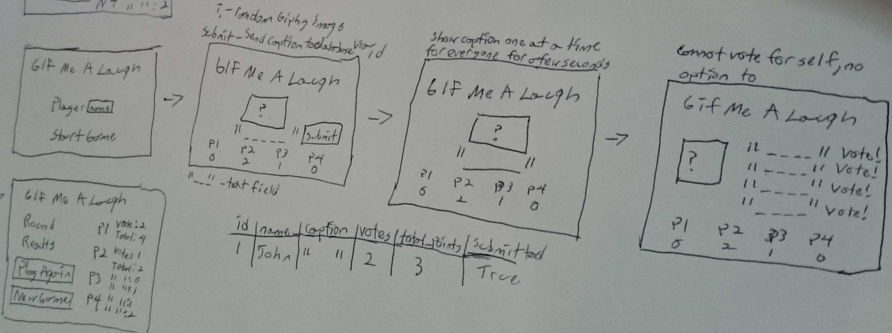
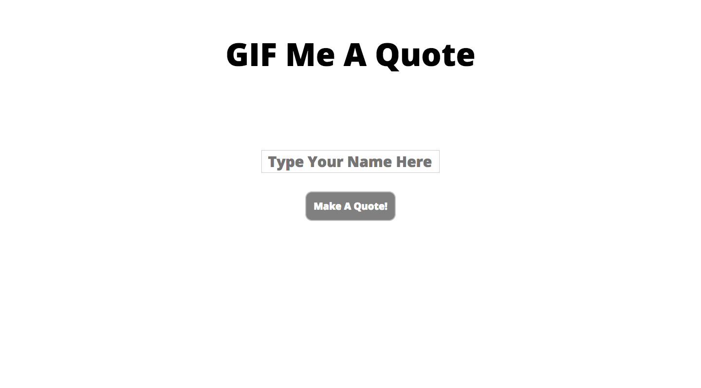
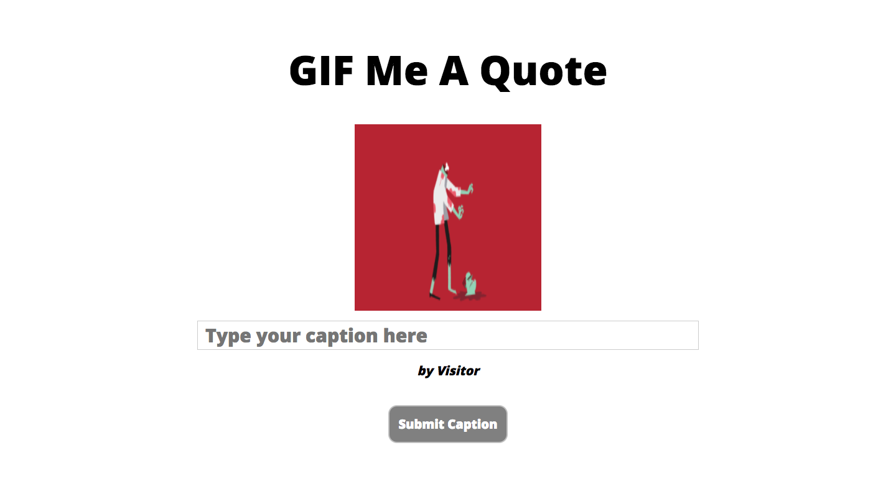

# GIF Me A Quote
> A website where the user adds a caption text to a randomly provided giphy image and rendering it on the screen.

[![NPM Version][npm-image]][npm-url]
[![Build Status][travis-image]][travis-url]

## Wireframes

## PsuedoCode
* Enter a name before starting the process (else one is given by default).
* The viewer must type into the textbox which will be saved as a string when submitted.
* If nothing is typed, a default message will be rendered instead.
* The viewer will then get to see their captions onscreen with their name and a giphy image.
* Finally there will be an option to start fresh which will clean up the database.

## Database Table

ID === SERIAL PRIMARYKEY 		 
NAME === VARCHAR			 
CAPTION === VARCHAR			 
VOTES === INTEGER			 
TOTAL === INTEGER			 
POSTED === BOOLEAN			 

| ID |  Name  | Caption                | Posted |
|:--:|:------:|:----------------------:|:------:|
|  1 | John   | Batteries not included | True   |
|  2 | Nathan | I need an adult!       | True   |
|  3 | Cathy  | Shaken not stirred     | True   |
|  4 | Kris   | Come on Snake Eyes!    | False  |

## User Stories
* As a user I like to have a random image displayed everytime I play.
* As a user I like to not be able to write my own captions.
* As a user I like to have the option to start over.

## Project Images

## Technologies used/npm Modules
* HTML, CSS & Javascript - Building blocks used to create GIF Me A Lab using style and logic.

* Giphy API - Natively embed all the best features of the world's largest and most powerful GIF library into your app.
	* Link: https://github.com/Giphy/GiphyAPI

* NPM - A package manager for javascript.

* Express - Express is a fast, un-opinionated, minimalist web framework. It provides small, robust tooling for HTTP servers, making it a great solution for single page applications, web sites, hybrids, or public HTTP APIs.

* Nodemon - It is a simple monitor script for use during development of a node.js app, It will watch the files in the directory in which nodemon was started, and if any files change, nodemon will automatically restart your node application.

* Jquery - jQuery is a fast, small, and feature-rich JavaScript library.

* Socket - Its a node.js realtime framework server.

* Debug - Debug is a tiny node.js debugging utility modelled after node core's debugging technique.

## Meta
[Yamil Burgos](https://github.com/yamilburgos/) – yamil.burgos1293@gmail.com

## Contributing
1. Fork it (<https://github.com/yamilburgos/GIFMeAQuote/fork>)
2. Create your feature branch (`git checkout -b feature/fooBar`)
3. Commit your changes (`git commit -am 'Add some fooBar'`)
4. Push to the branch (`git push origin feature/fooBar`)
5. Create a new Pull Request

<!-- Markdown link & img dfn's -->
[npm-image]: https://img.shields.io/npm/v/datadog-metrics.svg?style=flat-square
[npm-url]: https://npmjs.org/package/datadog-metrics
[travis-image]: https://img.shields.io/travis/dbader/node-datadog-metrics/master.svg?style=flat-square
[travis-url]: https://travis-ci.org/dbader/node-datadog-metrics
